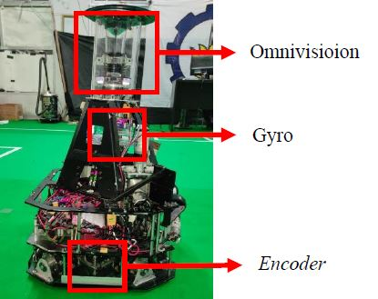
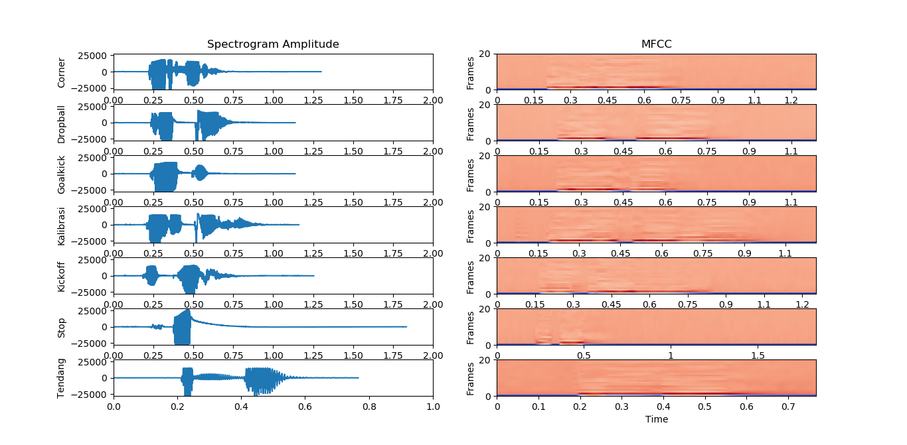
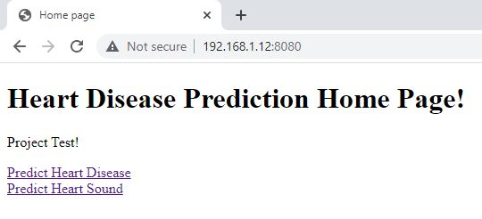
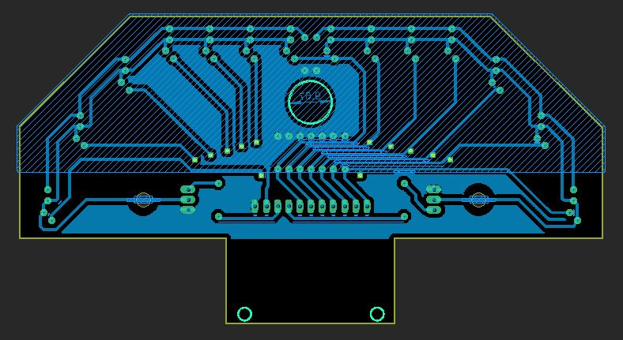
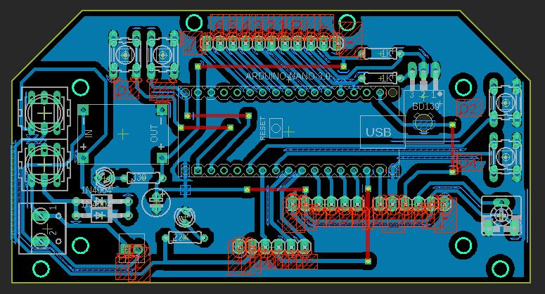
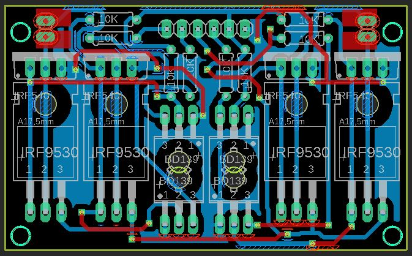
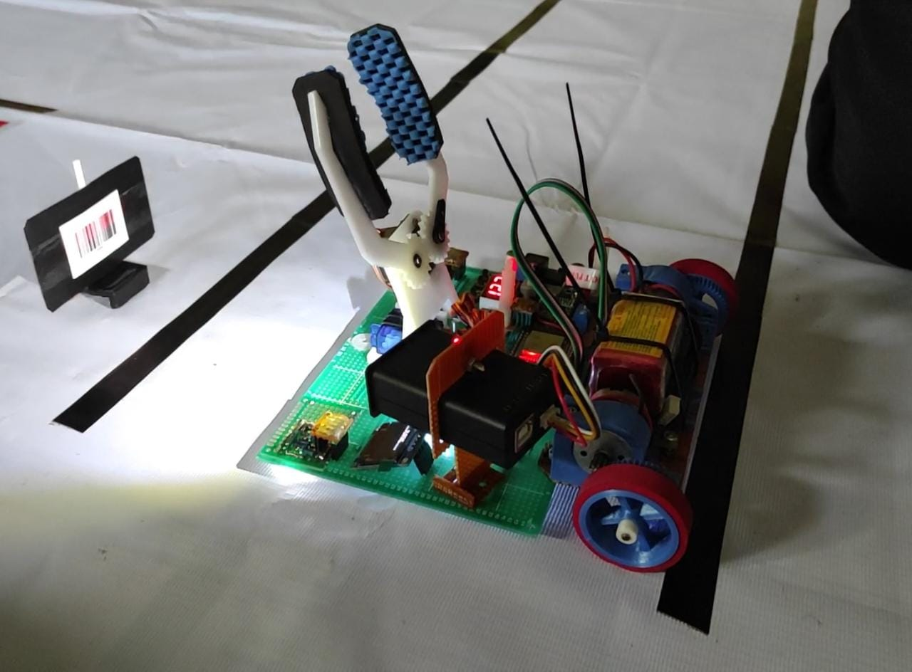

# [project_azhar](https://github.com/muhammadazhar15/project_azhar)
Collection of projects that have been made

# [PROJECT 1: Soccer Robot Localization Based on Sensor Fusion from Odometry and Omnivision](Project1-robot_localization)

 
 
 

  
* This research aims to create a new robot localization system for [IRIS ITS](https://iris.its.ac.id/) robots in the soccer field
* This localization system combines Odometry and Particle Filter through sensor fusion method
* Odometry uses 2 encoder sensors and a gyro sensor to sense robot displacement
* Particle Filter use omnivision as visual sensor to detect white line in the soccer field through image processing
* For more complete explanation about this research, you can check [this](Project1-robot_localization/Paper)

> **This is my early research particle filter with python**
> 
> https://user-images.githubusercontent.com/120243882/213215666-4653b4f7-5cf8-48bd-91ea-d05469076f68.mp4
> * if you want try this program you can check [this](Project1-robot_localization/Prototype_particle_filter)

> **This is particle filter that applied to the soccer robot**
> 
> https://user-images.githubusercontent.com/120243882/213215766-411f6838-0309-486a-b52c-df728a80d029.mp4

> **This is final localization system with senor fusion**
> 
> https://user-images.githubusercontent.com/120243882/213237570-8e828789-f15e-48b3-8e15-77b1aa8b0c28.mp4
> * The red line is the localization data generated by sensor fusion
> * This video compare sensor fusion data with original robot location in the soccer field

# [PROJECT 2: Voice Recognition System for Commands on Wheeled Soccer Robots](Project2-voice_command)

 
 &nbsp;&nbsp;&nbsp;&nbsp;&nbsp;&nbsp;&nbsp;&nbsp;&nbsp;&nbsp;&nbsp;&nbsp;&nbsp;&nbsp;&nbsp;&nbsp;&nbsp;
   

* This research conducted to give [IRIS ITS](https://iris.its.ac.id/) soccer robots some orders through human voice
* There are 2 main processes in this voice recognition system, record and recognition
* This research use CNN (Convolutional Neural Network) to recognize commands from human voice
* There are 7 commands that can be recognized ['Corner', 'Dropball', 'Goalkick', 'Kalibrasi', 'Kickoff', 'Stop', 'Tendang']
* In this research MFCC is used as feature extraction method to process data from human voice
* Data that used in CNN training process comes from 5 different people and 9 different people for test
* For more complete explanation about this research, you can check [this](Project2-voice_command/Paper)

> **Those are some visualization data from voice signal data and MFCC feature extraction results**
> 
> 

> **Voice Commands Demo for Soccer Robot**
> 
> https://user-images.githubusercontent.com/120243882/213928835-b99e419a-455b-4ef3-9824-324b2552bdfb.mp4

# [PROJECT 3: Heart Disease Detection System with ANN (Artificial Neural Network)](Project3-heart_disease_detector)

 
 &nbsp;&nbsp;&nbsp;&nbsp;&nbsp;&nbsp;&nbsp;&nbsp;
 

* Research project while teaching at [MA Darussalam Jombang](https://emispendis.kemenag.go.id/dashboard/?content=madrasah&action=lbg&nss=131235170053)
* Introducing AI (Artificial Intelligence) to Madrasah students, especially about Neural Networks
* This research was conducted with students to prepare for participate in [LKIR LIPI](https://kompetisi.brin.go.id/tentang/lkir) 2021
* Heart Disease Detection System is designed to detect disease through health status and heart sounds
* Health status data comes from [Kaggle](https://www.kaggle.com/datasets/johnsmith88/heart-disease-dataset) and heart sound data comes from [here](http://www.peterjbentley.com/heartchallenge/)
* The Heart Disease Detection System is applied in the website
* For more complete explanation about this research, you can check [this](Project3-heart_disease_detector/Paper)

> **Heart Disease Detection System Demo**
> 
> https://user-images.githubusercontent.com/120243882/213934320-be85940c-d860-4ea4-b8dd-51fb7ff6c627.mp4

# [PROJECT 4: Line Follower Robot Microcontroller](Project4-robot_line_follower)

 
 &nbsp;&nbsp;&nbsp;&nbsp;&nbsp;&nbsp;&nbsp;&nbsp;
 

* This project is used to introduce students in [MA Darussalam Jombang](https://emispendis.kemenag.go.id/dashboard/?content=madrasah&action=lbg&nss=131235170053) about embedded systems and robotics
* This robot uses Arduino nano as microcontroller and use C/C++ programming language in Arduino IDE
* There are 3 main board in this robot: Sensor, Core, and Driver
* This line followe use 14 line sensors (consist a pair of LED and Photodiode) with switching method, only need 7 ADC to read sensors data
* In Core board, there are buttons, lcd crystal, Arduino nano, and voltage regulator to supply the required voltage for entire robotic system
* DC motor driver is used to control motors rotation, to control 2 motors need 8 MOSFET and 4 BJT Transistors

> **PCB Design for Line Sensors, Core, and DC Motor driver**
> 
> 

>  
>  &nbsp;
>  
>  &nbsp;
>  
> 

> 
> * For this PCB design, you can check schematic and board with EAGLE [here](Project4-robot_line_follower/Design_PCB)
> * For simple mechanical design of this robot you can check [here](Project4-robot_line_follower/Design_mechanic)

> **Line Follower Robot Microcontroller Demo**
> 
> https://user-images.githubusercontent.com/120243882/213953569-85fc9a23-e856-4095-a18f-c3753762ad43.mp4
> * This robot can be programmed to go through certain tracks such as intersections, incline, black or white line
> * This robot also participate in [MRC 2020](https://madrasah.kemenag.go.id/mrc2020/) 

# [PROJECT 5: Transporter Robot IoT](Project5-robot_transporter_IoT)

 
 &nbsp;&nbsp;&nbsp;&nbsp;
 

* This project is used to teach students before participate in [MRC 2021](https://madrasah.kemenag.go.id/mrc2021/) competition
* This Transporter Robot uses ESP32 as microcontroller and can be programmed with Arduino IDE
* Components of Transporter Robot IoT

  <table>
    <tr>
     <td>ESP32</td>
     <td>TCS3200</td>
     <td>GM66</td>
     <td>OLED 128x64</td>
     <td>Gripper Servo</td>
    </tr>
    <tr>
     <td>Line Sensor</td>
     <td>Voltage Regulator</td>
     <td>Driver Motor</td>
     <td>Gearbox Motor</td>
     <td>Lipo battery 12v</td>
    </tr>
  </table>

* There are 3 sensors used by this robot: 2 Line sensor, Barcode Sensor GM66, and Color Sensor TCS3200
* Robot mission is scaning object barcode and then send object to drop location with same barcode
* This robot also send reports about activities that have been carried out such as take the object, drop the object, and object barcode
* The report send through MQTT protocol to this [MQTT Broker Websockets](http://www.hivemq.com/demos/websocket-client/)
* You can check some simple program used to access each sensor [here](Project5-robot_transporter_IoT/Program/trial_program) and program for the entire robot system [here](Project5-robot_transporter_IoT/Program/robot)

> **Transporter Robot IoT Demo**
> 
> https://user-images.githubusercontent.com/120243882/213965095-ef7a9108-83d1-48a8-8197-9af46c50bce0.mp4

